# FitGenius AI Architecture

## Overview

FitGenius AI is a full-stack personalized fitness and diet recommendation system. It uses a modern React single-page application (SPA) on the frontend and a Django Rest Framework (DRF) backend that powers the core API and machine learning operations.

## System Components

### 1. Offline ML Pipeline (Jupyter)

- **Path**: `Backend/notebooks`
- **Responsibilities**:
  - Ingest and normalize four primary CSV datasets into one shared recommendation corpus.
  - Map different source schemas into a 12-column production table containing demographics, health context, fitness goals, diet recommendations, and exercise plans.
  - Train a K-Nearest Neighbors content-based similarity model over normalized user-profile features.
  - Export the trained KNN model, preprocessing pipeline, experimental SVD model, and reference plan pool as static `.pkl` files.

### Dataset Layer

The production model is trained from `Backend/notebooks/data/merged_fitness_data.csv`, generated by `merge_datasets.py`.

| Source file | Rows | Used fields |
| :--- | ---: | :--- |
| `gym_recommendation.csv` | 14,589 | Age, sex, height, weight, BMI, hypertension, diabetes, activity level, fitness goal, diet, exercise recommendation |
| `diet_recommendations.csv` | 1,000 | Age, gender, height, weight, BMI, disease type, physical activity level, dietary restrictions, diet recommendation |
| `personalized_medical_diet.csv` | 5,000 | Age, gender, height, weight, BMI, chronic disease, dietary habits, recommended meal plan |
| `diet_workout_dataset.csv` | 2,600 | Heart rate, body temperature, exercise-plan and diet-plan identifiers; missing demographics are synthetically filled during merge |

Normalized merged columns:

`source`, `Age`, `Gender`, `Height`, `Weight`, `BMI`, `Chronic_Disease`, `Activity_Level`, `Dietary_Preference`, `Fitness_Goal`, `diet_recommendation`, `exercise_plan`.

The training script currently uses `Age`, `Height`, `Weight`, `Gender`, `Chronic_Disease`, `Activity_Level`, `Dietary_Preference`, and `Fitness_Goal` as model input features. `diet_recommendation` and `exercise_plan` are used as the recommendation targets/reference outputs.

### 2. Backend (Django + DRF)

- **Path**: `Backend/`
- **Core Apps**:
  - `users`: Custom User model and JWT-based authentication.
  - `profiles`: `HealthProfile` model storing demographic, medical, and lifestyle data metrics.
  - `recommendations`: Loads the static ML models into memory on server startup (via `apps.py`).
- **Inference Engine**: When requested, endpoints transform the user's profile with the saved preprocessor, retrieve nearest historical profiles with KNN, and combine the matched reference plan with template-based diet/workout generation and medical safety notes.

### 3. Frontend (React + Vite)

- **Path**: `Frontend/workout-recommender`
- **Responsibilities**:
  - User authentication.
  - Stable health-profile collection.
  - Dynamic daily check-in collection.
  - Recommendation generation and visualization.
  - History and progress tracking.

## Data Flow Diagram

```mermaid
graph TD
    A[CSV Sources] -->|merge_datasets.py| M[Merged 12-column Corpus]
    M -->|train_model.py| B(Static Model Files)
    B -->|Loaded on Server Start| C(Django recommendations App)

    D[React Client] -->|POST Credentials| E(Auth Endpoint - Django)
    E -->|Set Auth Cookie/Token| D

    D -->|POST/PATCH Profile| F(Profiles App)
    F -->|Store Stable Profile| G[(Database)]

    D -->|POST Daily Check-In| H(Check-In API)
    H -->|Store Dynamic State| G

    D -->|POST Generate Recommendation| C
    C -->|Load Profile + Latest Check-In| G
    C -->|Run KNN + Safety + Context Rules| C
    C -->|Store Recommendation Snapshot| G
    C -->|Return Diet + Workout JSON| D

    D -->|GET Latest/History| C
    D -->|Render Dashboard and History| D
```

