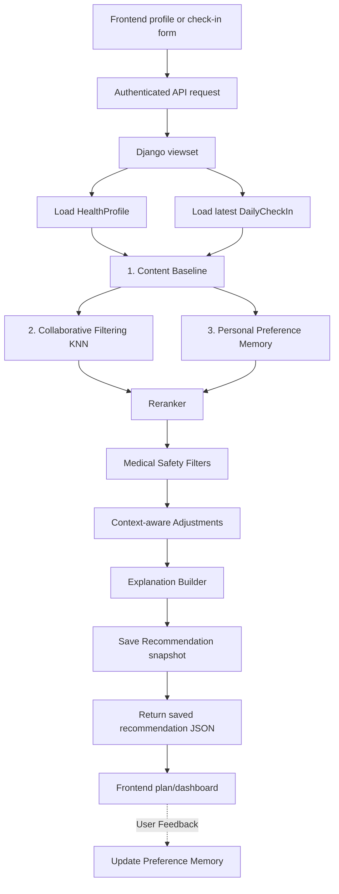

# FitGenius AI Architecture

## Overview

FitGenius AI is a full-stack fitness and diet recommender with a Django REST API and a React + Vite frontend. The backend owns authentication, profile storage, daily check-ins, and recommendation generation. The frontend collects user input, sends authenticated requests, and renders the latest recommendation state.

## System Layers

### 1. Offline ML And Template Layer

- **Path**: `Backend/notebooks/`
- **Responsibilities**:
  - Merge the source CSVs into a normalized recommendation corpus.
  - Train and export the similarity artifacts used by the recommendation engine.
  - Provide the reference plan pool used for similarity-weighted aggregation.

### 2. Backend API Layer

- **Path**: `Backend/`
- **Core apps**:
  - `users` - JWT auth and user profile endpoints.
  - `profiles` - `HealthProfile` and `DailyCheckIn` storage.
  - `recommendations` - recommendation generation, retrieval, and persistence.

### 3. Frontend Layer

- **Path**: `Frontend/workout-recommender/`
- **Core responsibilities**:
  - Login/register UI.
  - Auth context and token-aware API client.
  - Stable profile editor.
  - Daily check-in form.
  - Recommendation dashboard and plan view.

## Authentication Flow

1. The user logs in through `POST /api/auth/login/`.
2. The backend returns JWT access and refresh tokens and also sets HttpOnly cookies.
3. The frontend stores the tokens and sends `Authorization: Bearer <access>` on API calls.
4. If a request returns `401`, the client attempts one refresh using `POST /api/auth/token/refresh/`.

## Data Model Flow

### HealthProfile

Stores slowly changing or stable fields:

- demographics: age, gender, height, weight, BMI, BMI level
- medical history: chronic disease, hypertension, diabetes, blood pressure, cholesterol, genetic risk
- lifestyle: activity level, exercise frequency, sleep quality, smoking habit, alcohol consumption, daily steps
- nutrition and training preferences: diet, calories, macros, cuisine, aversions, goal, experience, workout type, equipment

### DailyCheckIn

Stores frequently changing readiness data:

- sleep quality and hours
- energy, soreness, stress
- current weight and resting heart rate
- workout completion, injury, available minutes, preferred intensity
- optional notes

### Recommendation & Feedback

The system uses a feedback-loop model comprising:

1. **Recommendation**: Stores the generated plan plus the evidence used to create it:
   - status, confidence, algorithm used
   - workout split, exercise plan, workout days per week
   - diet plan, calories, macros
   - health notes, RAG/LLM explanation, rag chunks
   - profile and check-in snapshots
   - similarity count and similarity score

2. **Feedback Models**: `RecommendationFeedback`, `ExerciseFeedback`, `MealFeedback` store explicit user interactions (`[Done]`, `[Skipped]`, `[Too Hard]`, ratings).

3. **UserPreferenceMemory**: A persistent state of learned user likes/dislikes (e.g. `disliked_exercises`, `preferred_foods`) derived from aggregated feedback.

## Recommendation Request Flow

> **Note**: For an in-depth breakdown of the Hybrid Recommender System, the mathematical formulas, and the sub-models used, please see [`docs/subsystems/recommendation_engine.md`](subsystems/recommendation_engine.md).

## API Surface

### Auth

- `POST /api/auth/register/`
- `POST /api/auth/login/`
- `POST /api/auth/token/refresh/`
- `POST /api/auth/logout/`
- `GET/PATCH /api/auth/profile/`

### Profiles

- `GET /api/profiles/`
- `POST /api/profiles/`

### Check-Ins

- `POST /api/checkins/`
- `GET /api/checkins/latest/`
- `GET /api/checkins/history/`

### Recommendations & Feedback

- `POST /api/recommendations/generate/`
- `GET /api/recommendations/latest/`
- `GET /api/recommendations/history/`
- `GET /api/recommendations/<id>/`
- `POST /api/recommendations/<id>/feedback/`
- `POST /api/recommendations/<id>/exercise-feedback/`
- `POST /api/recommendations/<id>/meal-feedback/`
- `GET /api/recommendations/metrics/`
- `GET/PATCH /api/preferences/memory/`

## Frontend Data Binding

The frontend loads and saves data through:

- `src/lib/api.ts` for authenticated requests
- `src/contexts/AuthContext.tsx` for auth state and token lifecycle
- `src/lib/recommendationData.ts` as a local fallback/cache layer

The primary screens map to backend concepts:

- `ProfileSetup` maps to `HealthProfile`
- `DailyCheckIn` maps to `DailyCheckIn`
- `MyPlan` maps to the latest `Recommendation`
- `Dashboard` summarizes the active profile, check-in, and recommendation

## Development Notes

- `Frontend/workout-recommender/vite.config.ts` proxies `/api` to the Django backend during local development.
- The app prefers backend data, but keeps a local cache so the UI can still render if the backend is temporarily unavailable.
- Recommendation history and progress are intentionally lightweight in the frontend and can be expanded without changing the core API contract.

