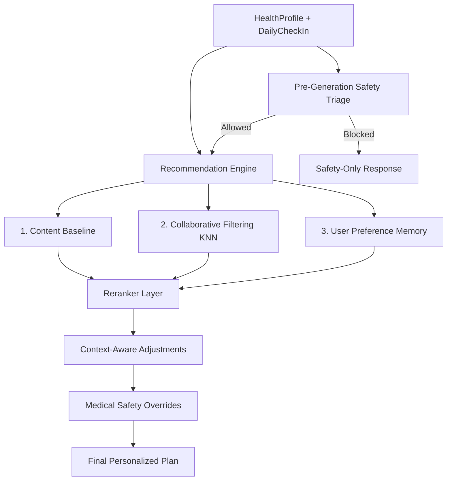

# Hybrid Recommendation Engine Subsystem

## Overview

FitGenius utilizes a **Late-Fusion Hybrid Recommendation System** to generate personalized workout and diet plans. The system is designed to provide high-quality initial recommendations (solving the cold-start problem) while becoming increasingly personalized over time through explicit user feedback and collaborative filtering.

The core of the engine is located in `Backend/recommendations/`.

## Architecture & Data Flow

The engine generates recommendations by selecting rule/template baselines, using KNN/similarity signals where available, applying feedback-based reranking, and enforcing deterministic safety overrides. It does not call an LLM to generate the workout or diet plan.

## Main Components

### 1. Content-Based Filtering (Base Templates)
- **Mechanism**: Evaluates the user's static `HealthProfile` attributes (Fitness Goal, Available Equipment, Dietary Preference) and selects a foundational workout and diet structure from static templates.
- **Purpose**: Provides a robust, logical starting point (e.g., Push/Pull/Legs for muscle gain) before any feedback is collected.

### 2. Collaborative Filtering
- **Module**: `collaborative.py`
- **Mechanism**: 
  1. Identifies a cohort of similar users by matching basic demographics and goals.
  2. Aggregates the cohort's explicit feedback (`ExerciseFeedback`, `MealFeedback`).
  3. Blends real app feedback with synthetic collaborative priors from `CF_SYNTHETIC_INTERACTIONS_PATH`.
  4. Calculates a normalized score. If similar users frequently mark an exercise as `[Done]`, it receives a boost. If they frequently mark it `[Too Hard]`, `[Pain]`, `[Skipped]`, or as a safety violation, it receives a penalty.
- **Purpose**: Leverages the "wisdom of the crowd" to surface exercises and meals that are statistically successful for the user's specific demographic.

Synthetic CF data is stored locally as `Backend/data/fitgenius_cf_synthetic_interactions.csv.gz` during development and is ignored by git. The loader caches the parsed rows in memory on first use, so the file is read once per backend process. Real user feedback keeps a higher weight than synthetic priors.

#### Synthetic Interaction Data Generation

The synthetic CF file represents simulated product telemetry, not real patient outcomes and not clinical evidence. It was generated to give the collaborative-filtering layer a realistic cold-start signal before the app has enough real `ExerciseFeedback` and `MealFeedback` rows.

Each row represents a user-item interaction with:

- synthetic user context: age, gender, BMI category, activity level, goal, experience level, diet preference, medical/injury flags, sleep, energy, stress, soreness, available time, and steps
- item metadata: `item_type`, `item_name`, category, intensity, goal tags
- ranking signals: base content score, daily context score, safety match score, collaborative prior score, personal history score, final rank score, and shown rank
- observed/simulated behavior: viewed, started/eaten, completed, skipped, rating, difficulty, pain reported, feedback tag, implicit feedback score, and outcome label
- data quality and safety flags: `data_quality_noise_flag`, `safety_violation_flag`, `safety_violation_reasons`

The backend does not import these rows into user feedback tables. Instead, `collaborative.py` reads the gzipped CSV, matches rows to the current profile cohort, and aggregates item-level priors. The score conversion intentionally penalizes skipped items, pain-reported items, and safety violations.

Current app-to-data category aliases include:

- `weight_loss` -> `fat_loss`
- `weight_gain` -> `muscle_gain`
- `maintenance` -> `general_fitness`
- `endurance` -> `heart_health`
- `non_veg` -> `non_vegetarian`
- `no_preference` -> all diet cohorts

Because the data is synthetic, it should be used for cold-start ranking only. Real feedback from authenticated users has higher weight and should eventually dominate the collaborative score.

### 3. Personalization Memory
- **Module**: `feedback.py` & `models.UserPreferenceMemory`
- **Mechanism**: The system tracks every interaction the user has with their plans. Over time, recurring signals are distilled into explicit preferences:
  - `preferred_exercises` / `preferred_foods`
  - `disliked_exercises` / `disliked_foods`
- **Purpose**: Ensures that explicitly disliked items are heavily penalized (often dropping out of the plan entirely) while favored items are prioritized.

### 4. Context-Aware Adjustments
- **Module**: `safety.py` (`apply_context_adjustments`)
- **Mechanism**: Uses the `DailyCheckIn` state.
  - *High Soreness*: Modifies focus to recovery and decreases sets.
  - *Low Energy/Poor Sleep*: Reduces reps and volume.
  - *Low Available Time*: Truncates the session to a "Quick Workout" format.
- **Purpose**: Adapts the long-term plan to the user's immediate, daily readiness.

## Reranking

The `reranker.py` module scores template items with content, collaborative, preference-memory, and context inputs. In the current implementation, context-aware check-in adjustments are applied as a separate deterministic pass after reranking.

Items that fall below a specific threshold (or are explicitly blocked by `UserPreferenceMemory`) are swapped out for fallback alternatives. Highly scored items may receive a progressive overload boost (e.g., increased volume).

## Rule-Based Medical Post-Filtering

**Safety supersedes algorithm ranking.** 

Before the engine generates a plan, `assess_medical_safety` checks the user's profile, latest check-in, and known medical flags. Emergency or clinician-review cases do not receive a personalized workout/diet plan; instead the engine returns a persisted `safety_guard` recommendation with general safety guidance.

After the reranker outputs the preferred plan, the `apply_medical_safety_filter` in `safety.py` executes a deterministic sweep.
- **Injuries**: Scrubs exercises targeting reported injury areas.
- **Hypertension**: Swaps out heavy isometric holds (e.g., long planks) and advises against the Valsalva maneuver.
- **High BMI**: Replaces high-impact plyometrics (e.g., burpees, box jumps) with low-impact alternatives.

See [`medical_safety.md`](medical_safety.md) for the full safety-level policy.

## Feedback Loops (The Learning Engine)

The system improves via explicit endpoints in `views.py`:
- `POST /api/recommendations/<id>/feedback/`: Overall plan rating (1-5 stars) and comments.
- `POST /api/recommendations/<id>/exercise-feedback/`: Item-level signals (`[Done]`, `[Skipped]`, `[Too Hard]`, `[Pain]`).
- `POST /api/recommendations/<id>/meal-feedback/`: Item-level signals (`[Eaten]`, `[Skipped]`, `[Hard to Prepare]`).

These signals are processed by `feedback.py` when feedback endpoints are called, updating the user's `UserPreferenceMemory` so future generated plans can avoid repeated dislikes and preserve recurring preferences.
