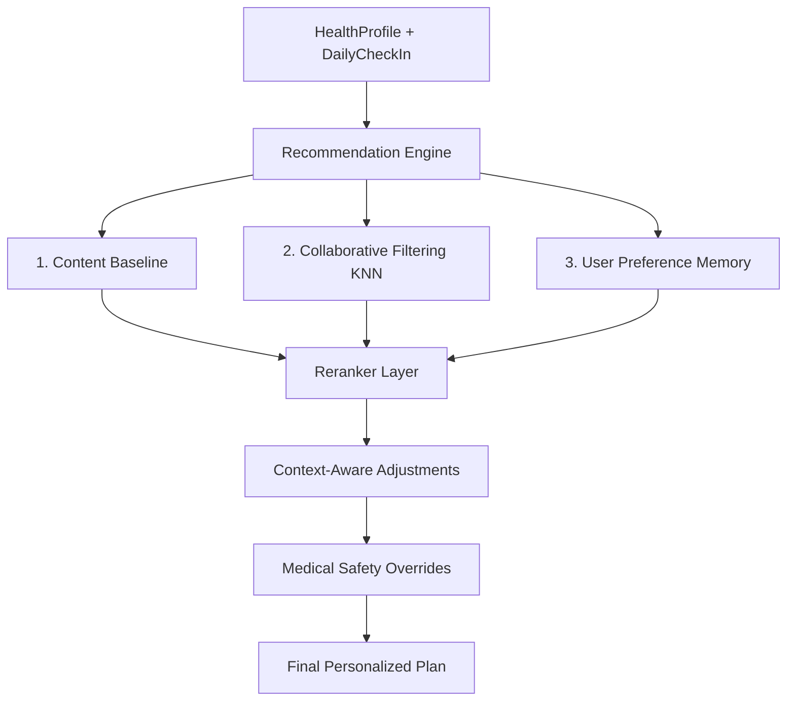

# Hybrid Recommendation Engine Subsystem

## Overview

FitGenius utilizes a **Late-Fusion Hybrid Recommendation System** to generate personalized workout and diet plans. The system is designed to provide high-quality initial recommendations (solving the cold-start problem) while becoming increasingly personalized over time through explicit user feedback and collaborative filtering.

The core of the engine is located in `Backend/recommendations/`.

## Architecture & Data Flow

The engine generates recommendations by blending multiple distinct sub-models together, calculating a unified score, and applying deterministic safety overrides.

## The Four Sub-Models

### 1. Content-Based Filtering (Base Templates)
- **Weight**: 45% of final score.
- **Mechanism**: Evaluates the user's static `HealthProfile` attributes (Fitness Goal, Available Equipment, Dietary Preference) and selects a foundational workout and diet structure from static templates.
- **Purpose**: Provides a robust, logical starting point (e.g., Push/Pull/Legs for muscle gain) before any feedback is collected.

### 2. Collaborative Filtering
- **Weight**: 25% of final score.
- **Module**: `collaborative.py`
- **Mechanism**: 
  1. Identifies a cohort of similar users by matching basic demographics and goals.
  2. Aggregates the cohort's explicit feedback (`ExerciseFeedback`, `MealFeedback`).
  3. Calculates a normalized score. If similar users frequently mark an exercise as `[Done]`, it receives a boost. If they frequently mark it `[Too Hard]` or `[Skipped]`, it receives a penalty.
- **Purpose**: Leverages the "wisdom of the crowd" to surface exercises and meals that are statistically successful for the user's specific demographic.

### 3. Personalization Memory
- **Weight**: 20% of final score.
- **Module**: `feedback.py` & `models.UserPreferenceMemory`
- **Mechanism**: The system tracks every interaction the user has with their plans. Over time, recurring signals are distilled into explicit preferences:
  - `preferred_exercises` / `preferred_foods`
  - `disliked_exercises` / `disliked_foods`
- **Purpose**: Ensures that explicitly disliked items are heavily penalized (often dropping out of the plan entirely) while favored items are prioritized.

### 4. Context-Aware Adjustments
- **Weight**: 10% of final score.
- **Module**: `safety.py` (`apply_context_adjustments`)
- **Mechanism**: Uses the `DailyCheckIn` state.
  - *High Soreness*: Modifies focus to recovery and decreases sets.
  - *Low Energy/Poor Sleep*: Reduces reps and volume.
  - *Low Available Time*: Truncates the session to a "Quick Workout" format.
- **Purpose**: Adapts the long-term plan to the user's immediate, daily readiness.

## The Reranker Formula

The `reranker.py` module evaluates the base plan against the sub-models using a weighted linear combination:
`Final Score = (0.45 * Content) + (0.25 * Collaborative) + (0.20 * Personal) + (0.10 * Context)`

Items that fall below a specific threshold (or are explicitly blocked by `UserPreferenceMemory`) are swapped out for fallback alternatives. Highly scored items may receive a progressive overload boost (e.g., increased volume).

## Rule-Based Medical Post-Filtering

**Safety supersedes algorithm ranking.** 

After the reranker outputs the preferred plan, the `apply_medical_safety_filter` in `safety.py` executes a deterministic sweep.
- **Injuries**: Scrubs exercises targeting reported injury areas.
- **Hypertension**: Swaps out heavy isometric holds (e.g., long planks) and advises against the Valsalva maneuver.
- **High BMI**: Replaces high-impact plyometrics (e.g., burpees, box jumps) with low-impact alternatives.

## Feedback Loops (The Learning Engine)

The system improves via explicit endpoints in `views.py`:
- `POST /api/recommendations/<id>/feedback/`: Overall plan rating (1-5 stars) and comments.
- `POST /api/recommendations/<id>/exercise-feedback/`: Item-level signals (`[Done]`, `[Skipped]`, `[Too Hard]`, `[Pain]`).
- `POST /api/recommendations/<id>/meal-feedback/`: Item-level signals (`[Eaten]`, `[Skipped]`, `[Hard to Prepare]`).

These signals are asynchronously processed by `feedback.py` to continuously update the user's `UserPreferenceMemory`, ensuring the next generated plan is immediately smarter.
